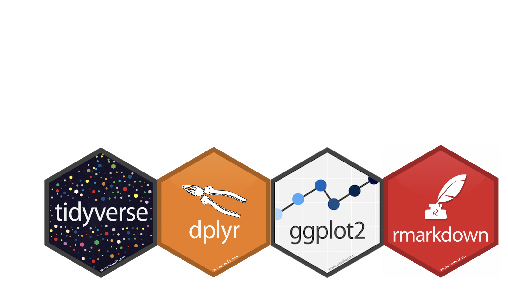
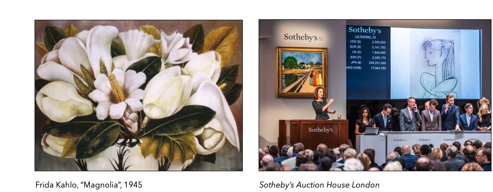
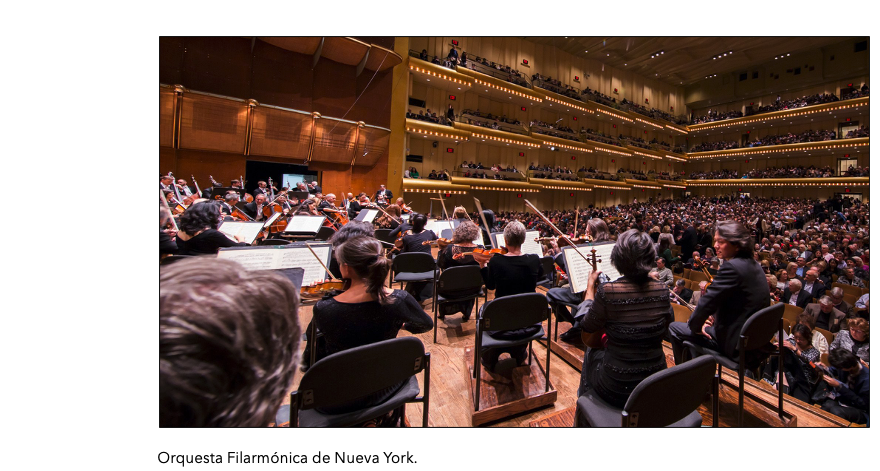
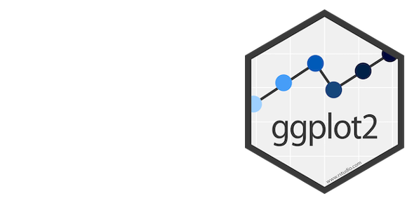

# Contenidos

.pull-left[

**A.-** Funciones en `R`

- <font color="#FF0066"><i>function</i></font>

**B.-** Distribución Binomial

- <font color="#FF0066"><i>rbinom</i></font>
- <font color="#FF0066"><i>dbinom</i></font>

**C.-** Likelihood y Log-Likelihood Functions

- <font color="#FF0066"><i>function</i></font>

**D.-** Tablas de Contingencia
- <font color="#FF0066"><i>load("nsca2018.Rda")</i></font>
- <font color="#FF0066"><i>library(dyply) %>%</i></font>

**E.-** Gráficos en `R`

- <font color="#FF0066"><i>ggplot2</i></font>

]

.pull-right[
**Nota**: el repositorio o library <font color="#FF0066"><i>"tidyverse"</i></font>, creado por Hadley Wickham, contiene 8 repositorios o libraries que estaremos utilizando constantemente a lo largo del curso (<font color="#FF0066"><i>ggplot2, dplyr, tidyr, readr, purrr, tibble, stringr, forcats</i></font>). 



]

---

# A.- Funciones en `R`


Si bien la instalación de `R` base incorpora las funciones necesarias para la estimación estadística y modelamiento de nuestros datos, en ocaciones es común que necesitemos realizar tareas para las cuales el lenguaje no ha especificado una función. Adicionalmente, al ser `R` un lenguaje de programación, podemos optimizar rutas o caminos de estimación creando nuestras propias funciones.


- ¿Cuáles son los componentes de una función?

```{r echo=TRUE, comment='#'}
# Sintaxis
area_trian <- function(base, altura) {(base * altura)/2}
cuad_bin <- function(a, b) {(a^(2)) + (2*a*b) + (b^(2))}
```
--
Donde los componentes:

**'area_trian'** = nombre asignado a la función que será ejecutado para llamarla.

**function** = comando que define argumentos y operaciones de la función.

**()** = argumentos de la función.

**{}** = operaciones de la función
---
# A.- Funciones en `R`

---
# A.- Funciones en `R`

- Ejercicio:

El valor de salida de una obra de arte subastada por la casa de coleccionistas Sotheby's es una función de los años de antigüedad de la obra, donde cada año cumplido agrega un plusvalor de 6000 $USD, siendo este total multiplicado por el número de exhibiciones internacionales en las que haya sido expuesta. Con todo, debido a la alta exclusividad de estas mercancías de *distinción*, el valor de salida es ponderado por el número de dueños previos de la obra.

--

**a.-** Defina una función que permita saber el valor de salida de las obras si la subasta fuera este año.

**b.-** ¿Cuál sería el valor de salida de la obra "Magnolias" de Frida Kahlo (1945), la cual ha participado de 15 exhibiciones internacionales y ha tenido solo 2 dueños a la fecha?

--
```{r echo=TRUE, comment='#'}
# Sintaxis
#a
valor_subasta <- function(year, intex, owners) {(((2020-year)*6000)*intex)/owners}
#b
magnolia <- valor_subasta(year=1945, intex=15, owners=2)
magnolia
```
---
# B.- Distribución Binomial

La simulación de variables aleatorias que sigan parámetros de distribución Bernoulli y Binomial puede ser ejecutadas a través de dos funciones incorporadas en `R` base.

--

**rbinom**: Esta función genera un vector de variables aleatorias distribuidas binomialmente.

```{r echo=TRUE, comment='#'}
# Sintaxis
coin1 <- rbinom(n=1, size=1, p=0.5)
coin1
```

--

Donde los argumentos:

**n** = número de experimentos independientes.

**size** = número de intentos o teraciones.

**p** = probabilidad de éxito.

---

# B.- Distribución Binomial

Ejemplo:

1) Lanzar una moneda con probabilidad $p=0.1$ de obtener 'Cara' (éxito).

```{r echo=TRUE, comment='#'}
# Sintaxis
ej1 <- rbinom(n=20, size=1, p=0.1)
ej1
```

--

2) Lanzar cien veces una moneda con probabilidad $p=0.4$ de obtener 'Cara' (éxito).


```{r echo=TRUE, comment='#'}
# Sintaxis
ej2 <- rbinom(n=100, size=1, p=0.4)
ej2
```

---

# B.- Distribución Binomial

**dbinom**: Esta función devuelve el valor de la función de densidad de probabilidad (pdf) de la distribución binomial.

--

```{r echo=TRUE, comment='#'}
# Sintaxis
coin2 <- dbinom(x=2,size=10,prob=0.3)
coin2
```

--

Donde los argumentos:

**x** = número de éxitos.

**size** = número de intentos o teraciones.

**p** = probabilidad de éxito.

---

# B.- Distribución Binomial

Ejemplo:

3) Si la probabilidad de obtener "Cara" es de 70% (*p*=0.7), ¿cuál es la probabilidad de obtener 7 éxitos en 30 lanzamientos?

$$\mathbb{P}(Y=7) = \frac{30!}{7!23!} \times (0.7)^{7} \times (1-0.7)^{23}= ?$$
--

```{r echo=TRUE, comment='#'}
# Sintaxis
ej3 <- dbinom(x=7,size=30,prob=0.7)
ej3
```

--

4) ¿ Y la probabilidad de obtener 21 éxitos en 30 lanzamientos?

--

```{r echo=TRUE, comment='#'}
# Sintaxis
ej4 <- dbinom(x=21,size=30,prob=0.7)
ej4
```

---
# C.- Likelihood y Log-Likelihood Functions

- **Likelihood Function**: Función que cuantifica la plausibilidad de diferentes valores del parámetro dados los datos.

 $\mathcal{L}(p) = P(X_{1})P(X_{2}) \dots P(X_{n}) = \frac{n!}{k! (n-k)!}*p^{k}(1-p)^{n-k} \quad \text{   donde  } k= \sum X_{i}$

--

- **Log-Likelihood Function**: Maximización de la likelihood function en base a las propiedades del logaritmo natural.

 $\ell\ell(p) = \ln \mathcal{L}(p)  = \ln\frac{n!}{k! (n-k)!}+ k \ln(p) + (n - k) \ln(1-p)$ 

--

- Así, el **Maximum Likelihood Estimation** de $p$ es la proporción de 1's en la muestra.

 $\hat{p} = \frac{\sum X_{i}}{n}$
 
 De acuerdo a lo visto anteriormente...

---
# C.- Likelihood y Log-Likelihood Functions

---
# C.- Likelihood y Log-Likelihood Functions

- Ejercicio:

Con el propósito de saber qué parte de los músicos clásicos más renombrados de EEUU deben el éxito en sus carreras al talento musical 'innato', y no a su capital económico, social y cultural, un sociólogo entrevista a 100 músicos de las orquestas filarmónicas más importantes del país para registrar quiénes tienen 'oido absoluto' asumiendo iid.  Posteriormente grafica los resultado de los y las entrevistados en su muestra. Como el investigador no cuenta con el parámetro poblacional, les pide ayuda para estimar qué valor *p* es más plausible que genere sus datos. 

```{r echo=FALSE, fig.height=4, fig.width=5, message=FALSE, warning=FALSE}
library(tidyverse)
library(wesanderson)

set.seed(1234)
data_musiques <- data.frame(X = rbinom(n=100, size=1, prob=0.01))

data_musiques %>% ggplot(aes(x=factor(X), fill="")) + 
    geom_bar(fill=wes_palette("Darjeeling1",n=2)[2]) +
    geom_text(aes(label=..count..), stat='count', vjust=-0.2) +
    guides(fill=FALSE, color=FALSE) + labs(x="Oído absoluto No (0), Sí (1)", y="Conteo") +
    theme(axis.text.y = element_text(size = 12), axis.text.x = element_text(size = 12),
    axis.title.y = element_text(size = 12), axis.title.x = element_text(size = 12))
```

---
# C.- Likelihood y Log-Likelihood Functions

- Ejercicio:

**a.-** Defina las funciones Likelihood y Log-likelihood en base al tipo de distribución que asumimos.

--

```{r echo=TRUE, comment='#'}
# Sintaxis
#a.Likelihood y Log-likelihood functions para una distribución binomial
L <- function(p, n, k){choose(n,k)*(p^(k))*((1-p)^(n-k))}
LL <- function(p,n,k) {log(choose(n,k))+(k * log(p)) + ((n - k)*log(1-p))}
```
--

**b.-** ¿Cuál es el valor $p$ más plausible de los datos del investigador de acuerdo a la Likelihood function? 
  
```{r echo=TRUE, fig.height=4, fig.width=5, message=FALSE, warning=FALSE}
# Sintaxis
#b.Estimación vía MLE y función de SE
p1 <- L(p=0.01,n=100,k=1)
p1
```
---
# C.- Likelihood y Log-Likelihood Functions

- Ejercicio:

```{r echo=TRUE, fig.height=4, fig.width=5, message=FALSE, warning=FALSE}
#Sintaxis
#b.Gráficamente
data_musiques2 <- data_frame(x = seq(from = 0, to = 1, by=0.01), y = (100*(x^(1))*((1-x)^(99)) ))
plot <- ggplot(data = data_musiques2, mapping = aes(x = x)) +
geom_path(aes(y=y), size=1.5, colour="#00A08A") +
labs(y="L(p)", x="p", title="Likelihood Function de p")
print(plot)
```
---
# C.- Likelihood y Log-Likelihood Functions

- Ejercicio:

**c.-** ¿Cuál sería el log-likelihood de músicos y músicas con 'oído absoluto' en las orquestas filarmónicas más importantes de EEUU para una probabilidad de 60% y 80% ? Evalúe.

--

```{r echo=TRUE, comment='#'}
# Sintaxis
#c.Evaluación 
p60 <- LL(p=0.6,n=100,k=1) 
p80 <- LL(p=0.8,n=100,k=1)
p60
p80
```

<font color="#FF0066"><i>Bonus</i></font>: ¿Qué debo hacer para conocer el valor probabilísticos de estos resultados?
---
# C.- Likelihood y Log-Likelihood Functions

- Ejercicio:

**d.-** Volviendo a los datos del investigador ¿Cuál sería el error estandar y los intervalos de confianza para un $\alpha=0.05$ a partir de la muestra? 

--
```{r echo=TRUE, comment='#'}
# Sintaxis
#d. Standard Error 
se <- function(n,p){sqrt((p*(1-p))/n)}
se_musiques <- se(100, 0.01)
se_musiques 

#d. Confidence Intervals
p_hat <- 0.01
ci_sup <- p_hat + 1.96 * se_musiques
ci_inf <- p_hat - 1.96 * se_musiques
```
---
# C.- Likelihood y Log-Likelihood Functions

- Ejercicio:

**d.-** Volviendo a los datos del investigador ¿Cuál sería el error estandar y los intervalos de confianza para un $\alpha=0.05$ a partir de la muestra? 

--
```{r echo=TRUE, comment='#'}
# Sintaxis
#d. Confidence Intervals
ci_sup 
ci_inf
```

El porcentaje de músicos clásicos renombrados con 'oído absoluto' parece estar entre 0% de quienes se encuentran en las orquestas más renombradas de EEUU, pero no superan el 3% entre estos profesionales.

---
# D.- Tablas de Contingencia


---
# D.- Tablas de Contingencia

En esta sección trabajaremos sobre los datos de la **National Survey of Culture and the Arts 2018** coordinada por el *National Endowment for the Arts USA* con un muestreo representativo de la población de EEUU. La muestra contiene 8609 casos y variables demográficas, socioeconómicas y de consumo cultural. En esta ocación trabajaremos con 10 de ellas.

```{r echo=TRUE, comment='#'}
# Sintaxis
#Cargar base de datos
load("nsca2018.Rda")
```

---

# D.- Tablas de Contingencia

En esta sección trabajaremos sobre los datos de la **National Survey of Culture and the Arts 2018** coordinada por el *National Endowment for the Arts USA* con un muestreo representativo de la población de EEUU. La muestra contiene 8609 casos y variables demográficas, socioeconómicas y de consumo cultural. En esta ocación trabajaremos con 10 de ellas.

```{r echo=TRUE, comment='#'}
# Sintaxis
#Exploración de datos
tibble(data1)
```

---
# D.- Tablas de Contingencia

Justamente, una de las discusiones más recientes en los estudios interseccionales de las relaciones entre género y preferencias culurales se ha centrado en comprender las distribuciones de datos entre formas estéticas y tipo de afluencias de públicos. En este contexto, parece interesante explorar los registros de públicos en estados unidos en función del género de los asistentes a 6 clases de eventos  del calendario anual de ofertas culturalesv(conciertos de jazz, música clásica, opera, ballet, exposiciones de arte contemporáneo en museos, y compras de libros).


```{r echo=TRUE, comment='#'}
# Sintaxis
#Relaciones multivariadas (en este caso bivariadas)
ctable1 <- data1 %>% with(table(sexo,jazz))
print(ctable1)
```
---
# D.- Tablas de Contingencia

```{r echo=TRUE, comment='#'}
# Sintaxis
#Relaciones multivariadas (en este caso bivariadas)
ctable2 <- data1 %>% with(table(sexo,ballet))
print(ctable2)

ctable3 <- data1 %>% with(table(sexo,museos))
print(ctable3)
```
---
# D.- Tablas de Contingencia

```{r echo=TRUE, comment='#'}
# Sintaxis
#Relaciones multivariadas 
ctable4 <- data1 %>% with(table(raza,jazz))
print(ctable4)
```
---
# D.- Tablas de Contingencia

- Ejercicio:


---
# D.- Tablas de Contingencia

- Ejercicio:

Una de las discusiones más interesantes en la configuración de los mundos de arte musical en la cultura popular estadounidense, recientemente ha girado  en torno a la inversión simultanea entre *performers* y *públicos* en base a la composición de género de éstos. Dicha particularidad, observan investigadores en sociología de la música, resulta ser particularmente acentuada en la constitución de la música jazz. A diferencia de los años 1930s y 1940s, en que las mujeres eran las grandes protagonistas de los escenarios y los hombres eran el principal público, en la actualidad esta relación se habría invertido, dando como resultado el escazo protagonismo femenino en los escenarios, generando un desplazamiento de éstas hacia públicos. Se cree que hoy el principal público que asiste a eventos de música jazz, son mujeres.

Exploremos inicialmente esta relación en base a los públicos de jazz en el 2018 con **n=8609**:

**a.-** De acuerdo a la relación bivariada jazz|sexo, en 2018 ¿cuál era la probabilidad de haber encontrado una **mujer que haya asistido a eventos de jazz** y la probabilidad de haber encontrado un **hombre que haya asitido**?

**b.-** ¿Cuál era la probabilidad de haber sido un **hombre** y, de forma independiente, la probabilidad de haber sido alguien que **no asistió a eventos de jazz** en 2018?

**c.-** ¿Cuál era la probabilidad de que, **siendo una mujer estadounidense**, no **hayas asistido a un evento de jazz** en 2018?

---
# D.- Tablas de Contingencia

**a.-** De acuerdo a la relación bivariada jazz|sexo, en 2018 ¿cuál era la probabilidad de haber encontrado una **mujer que haya asistido a eventos de jazz** y la probabilidad de haber encontrado un **hombre que haya asitido**?

--

```{r echo=TRUE, comment='#'}
# Sintaxis
#Relaciones multivariadas (en este caso bivariadas)
ctable1 <- data1 %>% with(table(sexo,jazz))
print(ctable1)

# Distribución conjunta
joint_dis <- ctable1/sum(ctable1); joint_dis 
```
---
# D.- Tablas de Contingencia

**b.-** ¿Cuál era la probabilidad de haber sido un **hombre** y, de forma independiente, la probabilidad de haber sido alguien que **no asistió a eventos de jazz** en 2018?

--

```{r echo=TRUE, comment='#'}
#Sintaxis
#Distribución marginal de sexo 
margin_sexo <- apply(joint_dis,1,sum); margin_sexo 

#Distribución marginal de jazz 
margin_jazz <- apply(joint_dis,2,sum); margin_jazz

```
---
# D.- Tablas de Contingencia

**c.-** ¿Cuál era la probabilidad de que, **siendo una mujer estadounidense**, no **hayas asistido a un evento de jazz** en 2018?

--

```{r echo=TRUE, comment='#'}
#Sintaxis
#Distribucuiones condicionales
ctable1 <- data1 %>% with(table(sexo,jazz)) # relacion bivariada como tabla de contingencia
joint_sexo_jazz <- ctable1/sum(ctable1) #distribución conjunta de las variables
margin_sexo <- apply(joint_sexo_jazz,1,sum) # distribución marginal de sexo
joint_sexo_jazz/margin_sexo #distribución condicional de jazz dado sexo 
```

---
# D.- Tablas de Contingencia


<font color="#FF0066"><i>Bonus</i></font>: ¿Cuáles serían las **probabilidades esperadas** si asumieramos que sexo y la asistencia a eventos de música jazz son variables totalmente independientes entre sí?

--

**Distribuciones marginales**
```{r echo=FALSE}
#marginal sexo 
margin_sexo <- apply(joint_dis,1,sum); margin_sexo 
#marginal jazz 
margin_jazz <- apply(joint_dis,2,sum); margin_jazz
```

--

**Probabilidad esperada bajo** $X \perp Y$

```{r}
#Distribución 
joint_sexo_jazz_ind <- margin_sexo %*% t(margin_jazz)
print(joint_sexo_jazz_ind)
```
---
# D.- Tablas de Contingencia


<font color="#FF0066"><i>Bonus</i></font>: ¿Y las **frecuencias esperadas**?

--

```{r}
#Frecuencias esperadas bajo independencia
joint_sexo_jazz_freq <- joint_sexo_jazz_ind*8609 
print(joint_sexo_jazz_freq)
```

---
# E.- Gráficos en `R`

Una de las herramientas más útiles para la exploración y evaluación de nuestros datos son los análisis visuales disponibles a partir de distintas funciones de `R`. Con todo, uno de los repositorios más útiles y de más alta potencia gráfica es  **library(ggplot2)** el cual forma parte de las funciones incluidas en la librería **library(tidyverse)**. 

A continuación veamos una breve introducción a su sintaxis y usos.



---
# E.- Gráficos en `R`

- Existen 3 elementos centrales en la sintaxis del comando *ggplot*:

**1** - Una estructura visual (aesthetic) que le informa a  *ggplot* qué variables serán mapeadas en el eje *X* e *Y*, (y frecuentemente otros atributos del gráfico, como los esquemas de color con que serán completados). Intuitivamente, <font color="#009999"><i>`aes`</i></font> puede ser pensada como la función que especifica qué estarás graficando.

**2** - Una geometría (geom) que le informa a *ggplot* cuál será la estructura básica para la creación del gráfico. Intuitivamente, <font color="#009999"><i>`geom`</i></font> puede ser pensada como la función que especifica cómo estarás graficando.

**3** - Otras opciones de customización (labels), como los títulos del gráfico, los tamaños de los elementos, el tipo de tema de construcción, etc. En la función esto es conocido como <font color="#009999"><i>`labs`</i></font>.

Entonces:

- $ggplot=aes+geom+labs$

- $ggplot=(df,x=, y=) + (type, fill) + (title, subtitle, caption)$

Veamos ejemplos concretos usando la NSCA.

---
# E.- Gráficos en `R`

- Exploremos el tipo de gráficos en base a la distribución del n de hijes de las personas en la muestra:

<font color="#009999"><i>Histograma</i></font>:

```{r echo=TRUE, fig.height=3.5, fig.width=4.5, message=FALSE, warning=FALSE}
#Sintaxis
#Histograma de número de hijes
ggplot(data1, aes(x = hijes)) + 
  geom_histogram(fill=wes_palette("Darjeeling1",n=2)[2]) + 
  labs(title = "NSCA 2018", subtitle = "Histograma de Hijes", 
       caption = "Figura 1", x = "hijes", y = "conteo")
```
---
# E.- Gráficos en `R`

- Exploremos el tipo de gráficos en base a la distribución del n de hijes de las personas en la muestra:

<font color="#009999"><i>Densidad</i></font>:

```{r echo=TRUE, fig.height=3.5, fig.width=4.5, message=FALSE, warning=FALSE}
#Sintaxis
#Densidad de número de hijes
ggplot(data1, aes(x = hijes)) + 
  geom_density(fill=wes_palette("Darjeeling1",n=2)[2]) + 
  labs(title = "NSCA 2018", subtitle = "Histograma de Hijes", 
       caption = "Figura 2", x = "hijes", y = "densidad")
```
---
# E.- Gráficos en `R`

- Exploremos ahora las distribuciones de los campos culturales:

<font color="#009999"><i>Barras</i></font>:

```{r echo=TRUE, fig.height=3.5, fig.width=4.5, message=FALSE, warning=FALSE}
#Sintaxis
#Gráfico de barras libros
ggplot(data1, aes(x = libros)) +
  geom_bar(fill=wes_palette("Darjeeling1",n=2)[2]) + 
  labs(title = "NSCA 2018", subtitle = "Frecuencia Libros", 
       caption = "Figura 3", x = "libros", y = "conteo")
```
---
# Referencias Sugeridas:

• Laurie Hanquinet & Mike Savage (2016). Routledge International Handbook of the Sociology of Art and Culture. London: Routledge.

• Hadley Wickham (2015). Advanced R, CRC Press, Taylor & Francis Group, Boca Raton, FL. En https://adv-r.hadley.nz/

• Hadley Wickham and Garrett Grolemund (2017). R for Data Science. Import, Tidy, Transform, Visualize, and Model Data. O’Reilly Media, Inc.. En https://r4ds.had.co.nz/


---
class: inverse, center, middle

.huge[
**¡Hasta la próxima!**
]

 💻 📊 🎨🎻🎷 
 
<br>
Roberto Velázquez <br>
https://github.com/rovelazqu <br>


