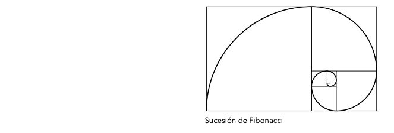
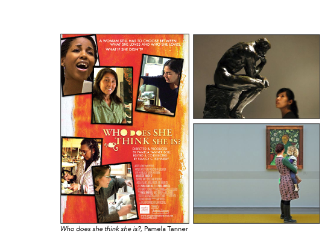

# Contenidos 

.pull-left[

**A.-** Loops en `R`

- <font color="#FF0066"><i>for_if</i></font>

**B.-** Medidas de Asociación

- <font color="#FF0066"><i>load("nsca2018.Rda")</i></font>
- Diferencia de proporciones $\delta$ 
- Riesgo Relativo *RR* 
- Odds Ratio $\theta$

**C.-** Inferencia Estadística

- <font color="#FF0066"><i>load("nsca2018.Rda")</i></font>
- Intervalos de Confianza
- Test $\chi^2$
- Test Likelihood-Ratio $G^2$

**D.-** Lineal Probability Model (LPM)

- <font color="#FF0066"><i>load("nsca2018.Rda")</i></font>

]


---

# A.- Loops en `R`

Los loops ("ciclos" o "bucles" en español) son un tipo especial de funciones en `R` que sirven para ejecutar una tarea determinada una cantidad *n* de veces. Se llama iteración a cada una de estas repeticiones, y sirven para hacer en segundos lo que manualmente llevaría horas, días o sería simplemente demasiado. Por ejemplo, creemos una sucesión de 100 números comenzando en 1 y el incremento entre dos números consecutivos siendo de 3 unidades. Es decir, 1, 4, 7, 10,. . .

--


```{r echo=TRUE, comment='#'}
# Sintaxis for
x <- c(1:100)
x[1] <- 1
for(i in 2:100){x[i] <- x[i-1]+3}
x
```

---

# A.- Loops en `R`

- ¿Cuáles son los componentes de un loop?

```{r echo=TRUE, comment='#'}
# Sintaxis for
x <- c(1:100)
x[1] <- 1
for(i in 2:100){x[i] <- x[i-1]+3}
```

Donde los componentes:

**for** = función que identifica los procedimientos del loop.

**in** = especificación del objeto (vector, factor, matriz) sobre el que se llevarán a cabo las iteraciones.

**()** = argumentos de unidades *i* o *j* de la función.

**{}** = operaciones de la función sobre cada *i* o *j*

---

# A.- Loops en `R`

Note que las especificaciones de un loop pueden ser aplicadas para la creación de distintos objetos, como es el caso de una matriz con filas *i* y columnas *j*. Por ejemplo, es posible especificar una matriz cuadrada de tamaño 10 donde el valor de las coordenadas (i,j) de la matriz es *|i − j|*.

--

```{r echo=TRUE, comment='#'}
# Sintaxis for
m <- matrix(NA,10,10) 
for(i in 1:10){for(j in 1:10){m[i,j] <- abs(i-j)}}  
m
```

---

# A.- Loops en `R`

Conjuntamente, es posible especificar más aún la función *for* al incorporar procedimientos lógicos que evalúan el cumplimiento o no de ciertas condiciones *if*. Por ejemplo, podríamos reemplazar valores negativos de *i* por sus valores absolutos en un objeto (vector, factor, matriz) dado. 

--

```{r echo=TRUE, comment='#'}
# Sintaxis if
x <- c(-5,-4,-3,-2,-1,0,1,2,3,4,5) 
for(i in 1:length(x)){if (x[i] < 0 ){x[i] <- abs(x[i])}} 
x
```

Donde los componentes *if*:

**if** = función de especificación lógica.

**()** = condiciones lógicas para unidades *i* o *j* de la función.

**{}** = operaciones de la función *if* sobre cada *i* o *j*
---

# A.- Loops en `R`

- Ejercicios:

1) Crear una sucesión de 1452 valores numéricos comenzando en 0, para las iteraciones consecutivas en *i* de acuerdo a la función $i_n = i_{1/\sqrt2}-4$.

2) Crear una sucesión de los primeros 100 números de la *proporción aurea* de Leonardo Da Vinci (también conocida como sucesión de Fibonacci $\phi$), comenzando desde 1 para las iteraciones consecutivas en *i* de acuerdo a la función $i_n = i_{n-1}+i_{n-2}$.

3) Crear una matriz de 7x21 para la cual las coordenadas *i,j* corresponden a la función $i-(j^{(i^2)})$.


---

# B.- Medidas de Asociación

Trabajemos sobre los datos de la **National Survey of Culture and the Arts 2018** vista en la ayudantía pasada. Recordemos que la encuesta fue coordinada por el *National Endowment for the Arts USA* con un muestreo representativo de la población de EEUU. La muestra contiene 8609 y 10 de variables de interés.


---

# B.- Medidas de Asociación

```{r echo=TRUE, warning=FALSE, comment='#'}
library(tibble)
```

```{r echo=TRUE, comment='#'}
#Sintaxis
#Cargar base de datos
load("nsca2018.Rda")
tibble(data1)
```
---

# B.- Medidas de Asociación


---

# B.- Medidas de Asociación

En esta ocación estaremos trabajando sobre las medidas de asociación a través de la relación entre género y preferencias culurales, particularmente sobre las distribuciones de datos entre museos de arte contemporáneo y el tipo de afluencias de públicos que se observan en EEUU durante 2018.

```{r echo=TRUE, comment='#'}
# Sintaxis
#Relaciones multivariadas (en este caso bivariadas)
ctable1 <- data1 %>% with(table(sexo,museos))
print(ctable1)
```

**Recordatorio**: 

Tenemos independencia estadística si la ocurrencia de un evento no afecta la probabilidad de la ocurrencia de otro evento. Dicho de otro modo, la probabilidad de que ocurra $y$ es independiente de qué valor asume $x$. Por lo tanto, nos encontramos frente a independencia estadística si las probabilidades conjunta son iguales al producto de sus probabilidades marginales $P(XY) = P(X)P(Y)$. Las medidas de asociación nos permitirán justamente poder evaluar este escenario.
---

# B.- Medidas de Asociación

```{r echo=TRUE, comment='#'}
# Sintaxis
#Relaciones multivariadas (en este caso bivariadas)
ctable1 <- data1 %>% with(table(sexo,museos))
prop.table(ctable1,1)
```

**Recordatorio**

Sabemos que...

- $\delta = \mathbb{P}(Y=1 \mid X=1) - \mathbb{P}(Y=1 \mid X=0)$

- $RR=\frac{\mathbb{P}(Y=1 | X=1)}{\mathbb{P}(Y=1 | X=0)}$

- $\log \hat{\theta} = \log \frac{n_{11}n_{22}}{n_{12}n_{21}}$

---

# B.- Medidas de Asociación

.pull-left[
- **Contexto:**

En 2017 *Who does she think she is?* inauguró un interesante campo de discusión en torno al problema de la relación entre los públicos de arte y las diferencias de capital cultural de acuerdo al género de los amantes de los museos. Pamela Tanner notó a través de un set de numerosas entrevistas con mujeres artistas y visitantes de museos estadounidenses la persistente "generificación" de las artes visuales debido a la *dominación masculina* del sistema institucional de las artes en manos de hombres blancos, los cuales solo representan el 15% de los profesionales dentro del mundo de las artes. 

Así, parece interesante investigar la relación de asociación entre la asistencia a museos en Estados Unidos (los cuales concentran el 45% de las colecciones de arte contemporáneo del mundo) y el género de los públicos de arte. 
]


---

# B.- Medidas de Asociación

- Ejercicio:

```{r echo=FALSE, comment='#'}
# Sintaxis
#Relaciones multivariadas (en este caso bivariadas)
ctable1 <- data1 %>% with(table(sexo,museos))
prop.table(ctable1,1)
```

1) ¿Cuál es la diferencia de proporciones $\delta$ que se observa en la asistencia a museos durante 2018 en EEUU (*Y*) de acuerdo al género de los asistentes (*X*). Particularmente, la proporción de mujeres (*PM*) respecto a la de hombres (*PH*).
--
```{r echo=TRUE, comment='#'}
# Sintaxis
#Diferencia de proporciones
delta <- (0.267-0.226)
delta
```

--

R= Existe una diferencia de proporción de 0.041 entre mujeres en comparación con los hombres asistentes a museos.

---

# B.- Medidas de Asociación

- Ejercicio:

```{r echo=FALSE, comment='#'}
# Sintaxis
#Relaciones multivariadas (en este caso bivariadas)
ctable1 <- data1 %>% with(table(sexo,museos))
prop.table(ctable1,1)
```

2) ¿Cuál es el riesgo relativo $RR$ de que las mujeres asistan al museo en comparación con que los hombres asistan al museo?¿Existe una asociación?¿Es positiva o negativa?.
--
```{r echo=TRUE, comment='#'}
# Sintaxis
#Diferencia de proporciones
RR <- (0.267/0.226)
RR
RR_p <- (RR - 1)*100
RR_p
```
---

# B.- Medidas de Asociación

- Ejercicio

2) ¿Cuál es el riesgo relativo $RR$ de que las mujeres asistan al museo en comparación con que los hombres asistan al museo?¿Existe una asociación?¿Es positiva o negativa?.

R= El riesgo relativo de haber asistido a un museo de arte contemporáneo en 2018 es un 18% más alto para las mujeres en comparación con los hombres.

Sabemos que...

- Si $RR = 1$ no hay asociación entre la exposición al riesgo y el evento. 

- Si $RR > 1$ entonces la asociación es positiva. La exposición al riesgo está asociado a una mayor frecuencia del evento. 

- Lo contrario sucede si $RR < 1$, es decir estar expuesto al riesgo se asociado a una menor frecuencia del evento.

--

R= Considerando $Y$ (asistencia a museos) y $X$ (sexo), existe una asociación positiva en favor de mujeres sobre hombres asistentes a museos en 2018.
---

# B.- Medidas de Asociación

- Ejercicio

```{r echo=FALSE, comment='#'}
# Sintaxis
#Relaciones multivariadas (en este caso bivariadas)
ctable1 <- data1 %>% with(table(sexo,museos))
ctable1
```

3) ¿Cuáles son las odds de que un hombre estadounidense no asistiera a un museo de arte contemporáneo en 2018? ¿Cuál es la razón de odds de asistir a museos de arte contemporáneo en 2018 entre ambos sexos?.

--

```{r echo=TRUE, comment='#'}
# Sintaxis
# Valor probabilístico de éxito
p <- (3030/(889+3030))

# Odds (P/1-P)
odds <- (p/(1-p)) 
odds
```
--

R= Las odds ("chances") de que un hombre estadounidense no asistiera a un museo de arte contemporáneo en 2018 son de 3.4.

---

# B.- Medidas de Asociación

- Ejercicio

3) ¿Cuáles son las odds de que un hombre estadounidense no asistiera a un museo de arte contemporáneo en 2018? ¿Cuál es la razón de odds de asistir a museos de arte contemporáneo en 2018 entre ambos sexos?.

Ahora bien, en una tabla de 2x2 la razón de odds $\theta$ es la razón de éxito en dos filas, o $\theta= \frac{odds1}{odds2}=\frac{P_1/(1-P_1)}{P_2/(1-P_2)}$

Sabemos que...


- Si $\theta=1$ hay igualdad de odds ("chances") y, por lo tanto, hay independencia entre variables.

- Si $\theta > 1$ entonces el éxito es más probable para el grupo en el numerador (hombres en este caso).

- Si $\theta < 1$ entonces el éxito es más probable para el grupo en el denominador (mujeres en este caso).

---

# B.- Medidas de Asociación

- Ejercicio

3) ¿Cuáles son las odds de que un hombre estadounidense no asistiera a un museo de arte contemporáneo en 2018? ¿Cuál es la razón de odds de asistir a museos de arte contemporáneo en 2018 entre ambos sexos?.

```{r echo=TRUE, comment='#'}
# Sintaxis
# Razón de Odds 
theta <- ((889/3030)/(1253/3437)) 
theta
theta_p <- (theta-1)*100
theta_p
```

--

R= Las odds de que un hombre haya asistido a un museo en 2018 son 0.8 veces las odds de una mujer. Es decir, son aproximadamente un 20% más bajas que las de las mujeres asistentes a museos en 2018.

---

# C.- Inferencia Estadística

Continuando con nuestros cálculos previos...

- Ejercicio Intervalos de Confianza


1) ¿Es posible afirmar que nuestro valor $\delta= 0.041$, que observa en la muestra una diferencia de proporciones en la asistencia a museos de acuerdo al género durante 2018, es estadísticamente significativo a un 99% de confianza?

```{r echo=TRUE, comment='#'}
# Sintaxis
#CI Diferencia de proporciones
pm <- 0.267
ph <- 0.226
se <-  sqrt((pm*(1 - pm))/4690 +  (ph*(1 - ph))/3919)
ci99_delta <-  c(li=(delta - 2.58*se), ls=(delta + 2.58*se)) 
print(ci99_delta)
```

--

R= La diferencia de proporciones observada es estadísticamente significativa a un 99% de confianza.

---

# C.- Inferencia Estadística

Continuando con nuestros cálculos previos...

- Ejercicio Intervalos de Confianza

2) ¿Es posible afirmar que nuestra razón de odds $\theta= 0.804$, que observa en la muestra la asistencia a museos de arte contemporáneo en 2018 entre ambos sexos, es estadísticamente significativo a un 99% de confianza? *Ojo*: Recuerde utilizar $log(\theta)$, pues su distribución simétrica y asíntotica es más cercana a una distribución normal (y podemos recurrir a todas sus ventajas).

```{r echo=TRUE, comment='#'}
# Sintaxis
# IC Log Razón de Odds 
log_theta <- log(theta)
se_log_theta <- sqrt(1/889+1/3030+1/1253+1/3437)
ci99_log_theta <- c(li=exp(log_theta - 2.58*se_log_theta), ls=exp(log_theta + 2.58*se_log_theta))
print(ci99_log_theta)
```
--

R= El $log(\theta)$ observado en la muestra es estadísticamente significativa a un 99% de confianza.
---

# C.- Inferencia Estadística

- Ejercicio Test $\chi^2$

1) ¿Es posible rechazar la $H_0$ que afirma la independencia estadística de la relación bivariada entre asistencia a los museos de arte contemporáneo y sexo de los asistentes en 2018? *Ojo*: Recordemos que en tablas de 2x2 la independencia estadística entre variables equivale a $H_0: \pi_{ij}=\pi_{i+}\pi_{+j}$, con una posible $H_1: \pi_{ij}\neq\pi_{i+}\pi_{+j}$  y que los grados de libertad están determinados por $df= (i-1)(j-1)$.

--
```{r echo=TRUE, comment='#'}
# Sintaxis
# Test Chi2 de independencia estadística
chisq.test(ctable1,correct = FALSE)
```
--

R= Con un valor $\chi^2 = 18.571$ y un $p=1.637e-05$ es posible rechazara $H_0$ y afirmar que no existe independencia estadística entre las variables en todos los niveles convencionales de confianza $p<0.001$, $p<0.01$, $p<0.05$. Hay asociación entre las variables. 

---

# C.- Inferencia Estadística

- Ejercicio Test Likelihood-Ratio $G^2$

1) ¿Es posible confirmar este resultado a través de un Test Likelihood-Ratio $G^2$? ¿Es un valor G grande o pequeño?.

```{r echo=TRUE, warning=FALSE, comment='#'}
library(DescTools)
```

```{r echo=TRUE, comment='#'}
# Sintaxis
# Test G2 de independencia estadística
GTest(ctable1, correct="none")
```

--

R= Con un valor $G^2 = 18.647$ y un $p=1.573e-05$ es posible rechazara $H_0$ y afirmar que no existe independencia estadística entre las variables en todos los niveles convencionales de confianza $p<0.001$, $p<0.01$, $p<0.05$. Hay asociación entre las variables. 

---

# D.- Lineal Probability Model (LPM)

.pull-left[
- **Contexto:**

En 2017 *Who does she think she is?* inauguró un interesante campo de discusión en torno al problema de la relación entre los públicos de arte y las diferencias de capital cultural de acuerdo al género de los amantes de los museos. Pamela Tanner notó a través de un set de numerosas entrevistas con mujeres artistas y visitantes de museos estadounidenses la persistente "generificación" de las artes visuales debido a la *dominación masculina* del sistema institucional de las artes en manos de hombres blancos, los cuales solo representan el 15% de los profesionales dentro del mundo de las artes. 

Así, parece interesante investigar la relación de asociación entre la asistencia a museos en Estados Unidos (los cuales concentran el 45% de las colecciones de arte contemporáneo del mundo) y el género de los públicos de arte. 
]


---

# D.- Lineal Probability Model (LPM)

- Codififación de variables y ajuste de LPM: 

```{r echo=TRUE, comment='#'}
#Sintaxis
#Nueva base de datos
tibble(data1)
```

---

# D.- Lineal Probability Model (LPM)

- Codififación de variables y ajuste de LPM: 

```{r echo=TRUE, message=FALSE, warning=FALSE, comment='#'}
library(tidyverse)
library(car)
```

```{r echo=TRUE, comment='#'}
# Sintaxis
#Conversión de factor a vector (tidyverse)
data1 <- data1 %>% 
  mutate(sexo_b = as.numeric(sexo))
data1 <- data1 %>% 
  mutate(museos_b = as.numeric(museos))
data1 <- data1 %>% 
  mutate(raza_b = as.numeric(raza))
#Codificación dummies (car)
data1$sexo_b <- recode(data1$sexo_b, "1=0; 2=1")
data1$museos_b <- recode(data1$museos_b, "1=1; 2=0")
data1$raza_b <- recode(data1$raza_b, "1=0; 2:26=1")
#Ajuste modelo
lmp1<- lm(museos_b ~ edad + sexo_b + raza_b, data=data1)
```

---

# D.- Lineal Probability Model (LPM)

- Modelo:

```{r echo=FALSE, comment='#'}
#Estimación de LMP
summary(lmp1)
```
---

# D.- Lineal Probability Model (LPM)

-  Lectura de coeficientes:

1) Efecto de Edad sobre la probabilidad de asistencia a museos de arte contemporáneo en 2018.

--

R= En promedio, por cada año más de edad de los individuos *i* la probabilidad de asistir a museos de arte disminuye 0.001, o en otras palabras disminuye en 0.1% controlando por las covariables del modelo. Este es un efecto significativo al 99,9% de confianza $p=3.89e-09$

--

2) Efecto de Sexo sobre la probabilidad de asistencia a museos de arte contemporáneo en 2018.

--

R= En promedio, el ser mujer en comparación con ser hombre aumenta la probabilidad de asistir a museos de arte en 0.043, o en otras palabras aumenta en 4.3% controlando por las covariables del modelo. Este es un efecto significativo al 99,9% de confianza $p=2.49e-06$

--

3) Efecto de Raza sobre la probabilidad de asistencia a museos de arte contemporáneo en 2018.

--

R= En promedio, el pertenecer a una raza no-blanca en comparación con blanco disminuye la probabilidad de asistir a museos de arte en 0.057, o en otras palabras disminuye en 5.7% controlando por las covariables del modelo. Este es un efecto significativo al 99,9% de confianza $p=3.47e-06$

---

# Referencias Sugeridas:

• Laurie Hanquinet & Mike Savage (2016). Routledge International Handbook of the Sociology of Art and Culture. London: Routledge.

• Hadley Wickham (2015). Advanced R, CRC Press, Taylor & Francis Group, Boca Raton, FL. En https://adv-r.hadley.nz/

• Hadley Wickham and Garrett Grolemund (2017). R for Data Science. Import, Tidy, Transform, Visualize, and Model Data. O’Reilly Media, Inc.. En https://r4ds.had.co.nz/


---
class: inverse, center, middle

.huge[
**¡Hasta la próxima!**
]

 💻 📊 🎨🎻🎷 
 
<br>
Roberto Velázquez <br>
https://github.com/rovelazqu <br>


